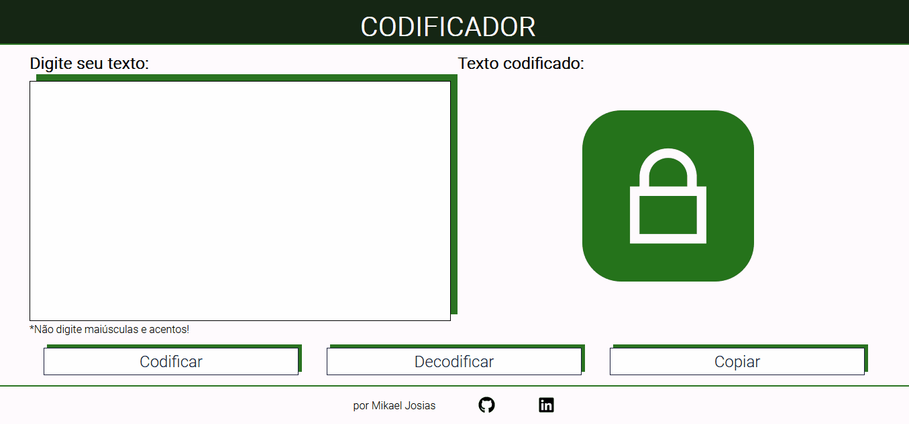
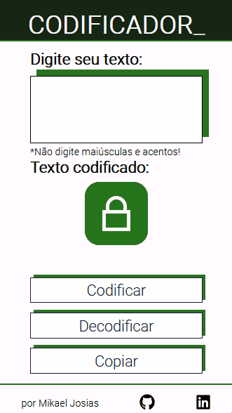

# <h1 style="text-align:center">Alura Challenge 🗝️ Oracle One 🗝️ Lógica de Programação  Decodificador de texto</h1>

## ✒️ DESCRIÇÃO:

Projeto desenvolvido para o primeiro desafio da Challenge Oracle ONE na formação de Iniciante em Programação, com o objetivo de aprender o básico da lógica de programação e JavaScript, foi proposto fazer um decodificador e codificador de texto em Javascript.

## 🏆 BADGE ESCLUSIVA DO DESAFIO:

## 🎯 REQUISITOS:

 - Deve funcionar apenas com letras minúsculas
 - Não devem ser utilizados letras com acentos nem caracteres especiais
 - Deve ser possível converter uma palavra para a versão criptografada e também retornar uma palavra criptografada para a versão original.

Por exemplo: "gato" => "gaitober" gaitober" => "gato"

 - A página deve ter campos para inserção do texto a ser criptografado ou descriptografado, e a pessoa usuária deve poder escolher entre as duas opções O resultado deve ser exibido na tela.
 
- Extras: Um botão que copie o texto criptografado/descriptografado para a área de transferência - ou seja, que tenha a mesma funcionalidade do ctrl+ C ou da opção "copiar" do menu dos aplicativos.

___

  <h2>Tecnologias utilizadas:</h2>
     

___

## <h2 >💻 A seguir apresento a prévia do projeto.💻</h2>
### DESKTOP

___
## 📱 Uma Prévia em dispositivos menores.📱
### MOBILE

